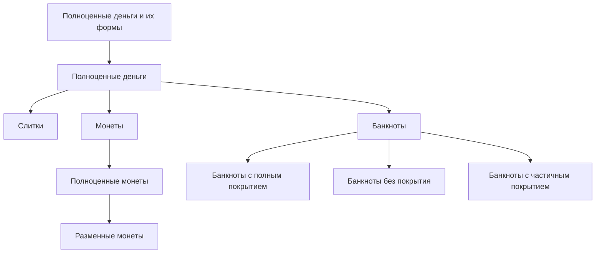
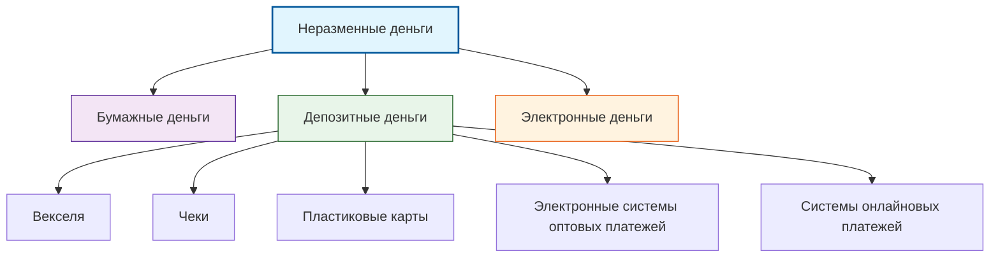

**<u>Содержание процесса эволюции денег проявляется в последовательной смене их видов и форм.
</u>**

Эволюция товарных отношений, обусловленная непрерывным развитием общественно-экономических формаций, приводит к совершенствованию и появлению новых форм обмена.
Поскольку в процессе обмена участвуют все члены общества, выбор средств обмена должен быть общепризнанным.
Обычно люди выбирают в качестве средства обмена такое благо, которое обеспечивает наименьшие издержки его использования в этой роли.
Кроме того, всеобщее признание определённого блага в качестве средства обмена зависит от его способности соответствовать основным денежным свойствам: долговечности, делимости, портативности, стандартизированности и узнаваемости.

---

# Виды и формы денег

## Основные виды денег

**Вид денег** — подразделение по природно-функциональному признаку.

### Три основных вида:
1. **Товарные деньги** (commodity money)
2. **Полноценные деньги** (full-bodied money)
3. **Неразменные деньги** (fiat money)

## Формы денег

**Форма денег** — внешнее выражение определённого вида денег.

### Современные формы кредитных денег:
- 📄 Бумажные деньги
- 💳 Депозитные деньги
- 💻 Электронные деньги

### Платежные инструменты:
- Чеки
- Пластиковые карты
- Электронные кошельки

---

## Товарные деньги

> [!definition] Определение
> **Товарные деньги** — реальные товары, выступающие в качестве регионального эквивалента, чья покупательная способность основана на их товарной стоимости.

### Классификация товарных денег:

#### 🐄 Анималистические деньги
- Скот
- Меха
- Раковины
- Кораллы

#### 💎 Гилоистические деньги  
- Камни
- Металлы
- Украшения
- Соль
- Янтарь
- Золотой песок

#### 🌱 Вегетабилистические деньги
- Зерно
- Плоды
- Табак

---


> [!note] Историческая справка
> Выбор средств обмена всегда должен был быть общепризнанным и обеспечивать наименьшие издержки использования.

---


---

# Полноценные деньги

**Полноценные деньги** — это вид денег, представляющий собой денежные знаки, покупательная способность которых прямо или косвенно основана на стоимости драгоценного металла (золота или серебра).

## Две формы полноценных денег

### 1. Полноценные деньги (в точном значении)
- **Покупательная способность** прямо основана на стоимости драгоценного металла
- **Номинал** совпадает с **товарной стоимостью**
- Примеры: золотые и серебряные монеты

### 2. Представители полноценных денег (разменные деньги)
- **Покупательная способность** косвенно основана на стоимости драгоценного металла
- **Номинал** значительно выше **товарной стоимости**
- **Обязательный обмен** по фиксированному курсу на полноценные деньги
- Примеры: банкноты с полным покрытием

## Ключевые характеристики
- Основа стоимости — драгоценные металлы (золото, серебро)
- Прямая или косвенная связь с товарной стоимостью
- Исторически предшествовали неразменным (фиатным) деньгам


> [!note] Историческая справка
> Система полноценных денег была основной в мировой экономике до отмены золотого стандарта в XX веке.

---
# Эволюция полноценных денег: от слитков к монетам

## Слитки
Первые полноценные деньги выпускались в форме **слитков**. Верховные правители клеймили слитки, удостоверяя чистоту металла и его вес, чтобы преодолеть неудобства определения количества и качества металла.

## Монеты
В отличие от товарных денег и немаркированных слитков, монеты стали первым универсальным платежным средством. Их преимущества:
- ✅ **Качество и вес удостоверялись пробой**
- ✅ **Узнаваемость**
- ✅ **Долговечность** 
- ✅ **Делимость**
- ✅ **Транспортабельность**

### Терминология монет
- **Аверс** (от франц. avers) — лицевая сторона
- **Реверс** (от франц. revers) — оборотная сторона  
- **Гурт** — ребро монеты

## Разменные монеты
- Представляли **дробные части полноценных монет**
- Чеканка происходила в **закрытом порядке** из государственного металла
- Производились на **государственном монетном дворе**

## Экономические понятия

### Монетный доход
Разность между **номиналом монеты** и **рыночной стоимостью** металла, затраченного на ее изготовление.

### Монетная регалия
**Монопольное право государства** чеканить неполноценную монету.

### Сеньораж (эмиссионный доход)
Прибыль от монопольного выпуска денег. Рассчитывается как разность между:
- Номиналом выпущенных денег
- Затратами на их производство

> [!note] Историческая значимость
> Круглая форма монеты оказалась самой удобной и стала стандартом для денежных систем всего мира.

---


# Банкноты: эволюция и виды обеспечения

## Историческая сущность банкноты

**Банкнота** первоначально представляла собой **расписку**, содержащую требование к банку-эмитенту выдать предъявителю указанное количество монет. 

**Ключевые характеристики классических банкнот:**
- Были **представителями полноценных денег**
- Не имели **принудительного курса**
- **Обязательно обменивались** на монеты по рыночному курсу

## Эмиссионное право

**Эмиссионное право** — право центрального (государственного) банка выпускать денежные знаки:
- Без монетарного покрытия
- Без специального разрешения законодательных органов

Масштабы эмиссионного права измерялись в **процентах от объема эмиссии покрытых банкнот**.

## Классификация банкнот по обеспечению

### 1. Банкноты с полным покрытием
- ✅ **Полное прямое покрытие** (золотом)
- ✅ **Обменивались на золото** в неограниченном количестве
- ✅ **Рыночный разменный курс**
- ✅ **Эмитировались** частными и государственными банками
- ✅ **Лимит эмиссии** — официальный золотой запас

### 2. Банкноты с частичным покрытием  
- ✅ **Прямое обеспечение**: драгоценные металлы + векселя
- ✅ **Обменивались на золото** в неограниченном количестве
- ✅ **Курс обмена ниже номинала**
- ✅ **Эмитировались** государственным банком
- ✅ **Ограничивались** институтом эмиссионного права

### 3. Банкноты без покрытия
- ❌ **Не имели прямого обеспечения**
- ❌ **Размен на золото не производился**
- ❌ **Признавались государственным долгом**
- ✅ **Эмиссионное право** за государственным банком
- ✅ **Периодически пересматривались** в сторону повышения

## Типы обеспечения

### Прямое обеспечение:
- Монеты из драгоценных металлов
- Векселя

### Косвенное обеспечение:
- Обязательство государства принимать банкноты в уплату:
  - Налоговых платежей
  - Прочих государственных платежей

---

## Бумажные деньги

**Характеризуются тремя признаками:**
- ☒ **Неразменность** (необеспеченность золотом)
- ☒ **Наличие принудительного курса**
- ☒ **Беспроцентность**

**Структура выпуска в развитых странах:**
-   **95—97%** — бумажные деньги (выпуск: правительства или центральные банки)
-   **3—5%** — разменные (биллонные) монеты (выпуск: казначейство)

---

## Депозитные деньги

> **Депозитные деньги** — это числовые записи определенной денежной суммы на счетах клиентов в банке.


 ---

# Неразменные деньги и их формы

## Основные формы

---


> **Неразменные деньги** представляют собой денежные знаки, замещающие в обращении полноценные деньги и выступающие как знаки кредита.

- **Наличные и электронные деньги** эмитируются для ==потребительских нужд==.
- **Депозитная эмиссия** имеет иной характер: депозитные деньги даются на время для ==производственных нужд==.

> 💡 Все формы неразменных денег предусматривают **юридическую ответственность** за отказ от исполнения взятых денежных обязательств.

### 🧠 Три причины широкого хождения неразменных денег

1.  **Общественное признание**
    Люди признают их в качестве средства обмена на товары и услуги. Это признание основано на доверии к эмитентам, базирующемся на долгосрочном опыте осуществления хозяйственных расчетов.

2.  **Предсказуемая стоимость**
    Неразменные деньги обладают предсказуемой покупательной стоимостью, которую можно оценить, руководствуясь темпами инфляции.

3.  **Законное средство платежа**
    -   **Наличные деньги** — обязательство государства.
    -   **Депозитные и электронные деньги** — долговое обязательство их эмитента.

---
# Вексель

```defenition
 Вексель — это безусловное письменное обязательство должника уплатить обозначенную на нем сумму в указанный срок.
```

## Особенности векселя
- **Абстрактность** - на векселе не указывается конкретный вид сделки
- **Безусловность оплаты** - включая принудительные меры после протеста нотариуса
- **Обращаемость** - используется как платежное средство при передаче с индоссаментом

## Классификация векселей

### По характеру сделки
- **Коммерческий вексель** - основан на реальных торговых сделках
- **Финансовый вексель** - денежный суррогат, применяется при предоставлении денег в долг
  - *Казначейский вексель* - выпускается государством для покрытия бюджетных расходов

### По типу обязательства
- **Простой вексель** - обязательство векселедателя оплатить
- **Переводной вексель (тратта)** - приказ векселедержателя (трассанта) плательщику (трассату) уплатить третьему лицу

## Границы вексельного обращения
1. Ограниченный срок обращения
2. Не может осуществлять выплату заработной платы и бюджетные платежи
3. Не может использоваться в нескольких платежных операциях
4. Обслуживает только торговый оборот
5. Ограниченный круг лиц

> Вексель не выполняет основные денежные функции и не является деньгами.
---
# Чек

> **Чек** представляет собой денежный документ установленной формы, содержащий безусловный приказ чекодателя кредитному учреждению о выплате держателю чека указанной в нем суммы.

## Классификация чеков

### По типу чекодателя
- **Персональные чеки** - выписаны физическими лицами
- **Коммерческие чеки** - выписаны коммерческими предприятиями  
- **Привилегированные чеки** - выписаны федеральными и местными органами власти

### По способу передачи
- **Именные чеки** - выписанные на определенное лицо без права передачи другому
- **Ордерные чеки** - составленные на определенное лицо, но с правом передачи другому лицу по индоссаменту
- **Предъявительские чеки** - выписанные без указания получателя, сумма выплачивается предъявителю

### По подтверждению платежеспособности
- **Акцептованные (удостоверенные) чеки** - банк удостоверяет подпись клиента и гарантирует оплату

## Особенности обработки
```process
Чеки обрабатываются в специальных клиринговых центрах, где имеются счета практически всех банков.
```
**Дорожный чек** - это стандартизированный денежный документ, представляющий собой обязательство кредитного института об обмене данного чека на наличные деньги по номиналу перед указанным владельцем чека или перед обозначенным им бенефициаром.

---

# Пластиковые карты и электронные платежные системы

## Пластиковая карта


**Пластиковая карта** — это именной денежный документ, выпущенный банком или иной специализированной организацией, удостоверяющий наличие в соответствующем учреждении счета владельца пластиковой карты и дающий право на приобретение товаров и услуг по безналичному расчету, а также на снятие наличных денег со счета.

**Электронные системы оптовых платежей** представляют собой платежные системы, позволяющие осуществлять в электронной форме платежные операции большой стоимости между банками, коммерческими компаниями и государственными учреждениями.

**Новые инструменты для платежей в Интернете** представляют собой новую разновидность электронных платежных инструментов, созданных с целью осуществления безопасных и удобных расчетов между субъектами электронной коммерции в открытых информационных сетях.

